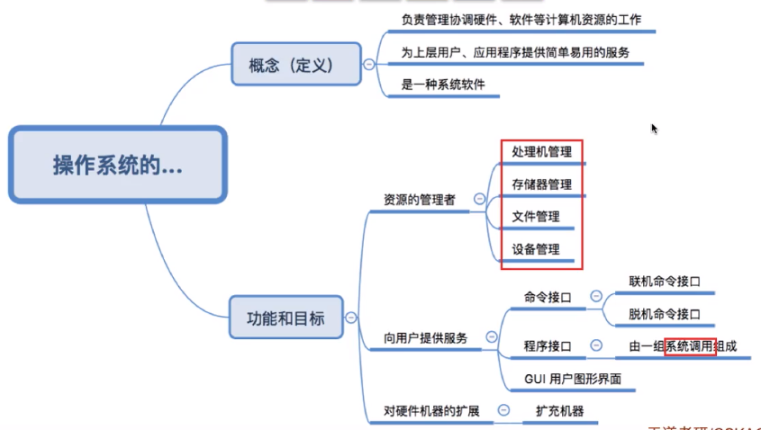

#  操作系统

# **基本课程**

## 操作系统的特征

### 并发性

**<u>并发性</u>**是操作系认的一个最基本特性

并行和并发的区别：

- **并行**是同一时刻同时进行两项任务，更高级
- **并发**是宏观上同时进行两个任务，但是微观上看一个时刻只进行一个任务

**单核CPU，多个程序只能并发执行**

**多核CPU，多个程序可以并发进行**

**并发 （Concurrency）：**


**并行 （Parallelism）：**


**并发 + 并行：**


### 共享

- **互斥共享**：只允许一个进程访问资源，比如**摄像头**
- **同时共享**：允许一个时间段由多个进程“同时”进行访问，比如**访问硬盘资源**

### 虚拟

将物理实体变为若干逻辑上的对应物

> **虚拟存储器技术：空分复用技术，可以让用户看起来的内存比实际内存大**
>
> **虚拟处理器：时分复用技术，让用户看起来有比实际更多的CPU服务**

虚拟存储器：


虚拟处理器：


### 异步

多道程序的环境下，允许多个程序并发执行，进程的执行不是一贯到底是而是走走停停，这就是**<u>进程的异步性</u>**

## 分类

### 多道批处理系统


### 分时操作系统

时间片为单位轮流为各个用户服务。允许多个用户同时使用一台计算机设备，**<u>每个用户对计算机的操作相互独立，感受不到别人的存在</u>**

缺点：因为**<u>*完全公平*</u>**，不能优先处理一些紧急任务


### 实时操作系统

**能够优先响应一些紧急任务**，某些紧急任务不需时间片排队


### 其他 


## 运行机制

**内核**：操作系统中最重要和最核心的部分。如Docker只需要Linux内核就能模拟

### 特权指令

**内核**作为操作系统管理者可以让CPU执行的**特权指令，如：内存清零指令，影响重大**

**非特权指令**：普通的应用程序只能使用这些指令，如加法指令，减法指令

> CPU在设计和生产的时候就划分了特权指令和非特权指令

CPU的两种状态：

- **内核态：运行的内核程序，可以执行特权指令**
- **用户态：运行的应用程序，只能执行非特权指令**

> CPU中的**程序状态寄存器（PSW）**，其中有个二进制位，***1表示内核态，0表示用户态***

**中断**：使得***操作系统重新夺回CPU的控制权***


### **内核态和用户态的转换**

**内核 -> 用户**： 修改**PSW标志位**为“用户态”

**用户 ->内核**：**中断**，让操作系统强行夺回CPU使用权


## 体系结构


**大内核：高性能，但难以维护内核**

**微内核:内核功能少**,方便维护，但因为**更频繁地"变态",更费事和耗时**


**总结**


## 操作系统引导（Boot）

***开机的时候让操作系统运行起来***，操作系统是在C盘里的


主存：**RAM（内存） + ROM（BIOS）**，RAM的程序已关机就消失，ROM不会。**ROM只读不写**

### 开机步骤

1. CPU开机后会进入主存找到**ROM引导程序**
2. 引导程序指示CPU将**主引导记录MBR**读入RAM
3. CPU**根据磁盘引导程序来扫描分区表**来找到**活动分区**（安装了操作系统的分区，一般是C盘）位置
4. CPU从C盘读入分区**分区引导记录PBR**
5. 从根目录下找到完整的**操作系统初始化程序（启动管理器**）并执行，完成开机

> BIOS程序是存储在一个ROM芯片中的
>
> bios是基本输入输出程序，第一次开机时从ROM芯片中拷入coms芯片中供调试bios程序,以后所用的都是coms中调好的bios程序,当coms中bios程序发生严重错误时,取下主板电池,使coms掉电而被清空,下次开机重新从ROM芯片中拷入原始bios.
> 所谓bios设置,实际是设置coms中的bios程序,所以又称coms设置.

## 进程

***操作系统进行资源分配和调度的独立单位***

一个进程实体是由***PCB 、程序段、数据段组成的***，***运行的程序都可以被视为一个进程***

计算机中运行的程序都可以被视为一个进程。一个进程可以包含多个线程，每个线程负责执行其中的一部分。操作系统通过进行**进程调度在不同的进程之间切换，保证每个进程都有公平的机会去使用 CPU 和其他系统资源**，从而实现多任务执行的效果。

特点：

**每个进程有自己的地址空间和资源，所以操作系统可以跟踪进程并为其分配和管理资源**。进程之间互相独立，因此不同进程之间互不干扰，即使其中一个进程出现了问题，也不会影响其他进程的正常运行。

一个进程通常包含以下几个部分：

- 进程的**程序代码**就是需要执行的指令序列，通常**存储在二进制可执行文件中，也可以存储在共享库或动态链接库中**。
- **数据区**是进程***保存变量或动态分配内存***的地方。这部分通常包括***全局变量、常量、静态变量***等。
- **堆**是进程***自己申请内存***的空间。程序员可以自由地在堆中分配或释放一块指定大小的内存，用来存储动态的数据结构。
- **栈**是用来保存**函数调用和局部变量**的空间。每个函数都有自己的调用栈，用来保存调用该函数时保存的信息以及函数参数和局部变量。

进程之间的通信可以通过**进程间通信（IPC）**的方式来实现。IPC 常见的方式包括**管道、消息队列、共享内存和信号量**等。

### PCB

***进程控制块，进程存在的唯一标示***。用于**存储操作系统对进程进行管理工作所需要的所有信息**

进程创建时，操作系统会给它 **进程分配一个唯一的不重复的身份证号——PID（Process ID）**

操作系统还会记录**进程所属用户（UID）**，分配了多少资源，如CPU使用情况，磁盘使用情况，网络流量等


### 程序是如何运行


### 进程状态


#### 创建态

操作系统为其***分配资源，初始化PCB***

#### 就绪态

进程创建完成，具备运行条件，但***由于没有空闲CPU所以暂时不能运行，有空闲CPU时就可以运行***

#### 运行态

进程在CPU上运行，执行该进程对应的执行指令序列

#### 阻塞态

***进程在某个事件发生之前无法继续执行，操作系统就会让他下CPU，进入阻塞态***

进程运行过程中，请求等待某个事件的发生，如等待系统资源的分配，等待其他进程的响应

等待的事件空闲后，**阻塞态 -> 就绪态**

#### 终止态

一个进程可以执行exit系统调用，请求操作系统终止该进程，此时该进程就会进入***终止态***

> 操作系统会让***进程下CPU，回收该进程的内存空间和PCB***

#### **五状态模型**

- **运行态 -> 阻塞态：主动行为，系统调用**
- **阻塞态 -> 就绪态：被动行为**

运行态是可以返回到就绪态，可能是时间片到了

创建 ：***就绪 -》 运行 -》 阻塞***：终止态


#### 七状态模型

五状态模型上加上了***阻塞挂起和就绪挂起***

**挂起和阻塞：**

都暂时不能获得CPU服务，但挂起状态将进程映像调到外存中，而阻塞态下进程映像还在内存中


**组织方式**

**链式方式（主流操作系统采用的），操作系统持有指向各个索引表的指针**


**索引方式**


### 进程控制

***为了实现进程的状态转换***

用**“原语”**实现，即***必须一气呵成***，否则可能导致信息不统一，进程出错

用**关中断**和**开中断**：只能让**内核使用**的两个特权指令，用来实现**原子性**


**创建原语**


**撤销原语**


**切换原语**


***进程切换时，PCB会保存当前的运行环境***


例：

- kernel_task：祖先进程，**launched的父进程**
- launched：**装入进程**，用来启动所有的别的进程，**所有别的进程都是它的子进程**
- 每个进程也可以创建自己的子进程


### **进程间通信**

在操作系统中，进程是一个很重要的概念。简单来说，进程就是运行在计算机上的一个具有独立资源的程序。有时候，我们需要多个进程之间进行通信，以共享数据或者相互协作。

**进程间通信（IPC）**就是用来实现多个进程之间数据交换和协作的一种机制。UNIX、Linux、Windows等操作系统都提供了各种方式的IPC机制。

在不同的操作系统中，支持的进程间通信方式不同。但是通常，进程间通信的方式可以分为以下几种：

#### 共享内存

***共享内存是非常高效的进程间通信方式，因为它可以避免数据拷贝的问题，数据传输速度很快，是一种高级通信方式***


共享内存通信是通过**共享同一段内存**来达到进程之间数据共享的目的。多个进程可以访问同一块内存，通过修改内存中的内容来传递信息。但是共享内存在**<u>并发编程中有着很高的难度</u>**，因为在共享内存时需要考虑到进程之间的同步和互斥问题。

在计算机系统中，多个进程需要共享某一个资源，比如说缓存区，这时候就可以使用共享内存的方式，让多个进程可以访问同一个共享内存区域，这个区域在内存中划分出来，像一个独立的内存地址一样，每个进程可以通过这个地址来访问共享内存，从而达到共享的目的。

共享内存是**非常高效的进程间通信方式，因为它可以避免数据拷贝的问题，这使得它比一些其他的进程间通信机制具有更快的速度。但同时也存在开销较高**、容易产生竞态条件等问题，因此在使用共享内存时需要注意这些问题。

#### 管道

本质是在***用循环队列实现的，内存中开辟的一个大小固定的内存缓冲区***，类似共享内存 

管道只能采用**半双工通信**，FIFO，***传输不能同时进行***。一个进程通过**系统调用构建管道，两个进程可以从这片内存中写或者读数据**


> 与共享内存的区别：
>
> 1. 管道的数据流必须是先进先出，写入位置有要求，不能像共享内存一样随意写
> 2. 管道需要在内核和用户空间进行**四次的数据拷贝**：由用户空间的buf中将数据拷贝到内核中 -> 内核将数据拷贝到内存中 -> 内存到内核 -> 内核到用户空间的buf。而**共享内存则只拷贝两次数据**：用户空间到内存 -> 内存到用户空间。
> 3. 管道用**循环队列实现**，连续传送数据可以不限大小。共享内存**每次传递数据大小是固定的**;
> 4. 共享内存可以**随机访问被映射文件的任意位置**，管道只能顺序读写;
> 5. 管道可以独立完成数据的传递和通知机制，共享内存需要借助其他通讯方式进行消息传递。

管道通信是指利用**管道进行数据交换和协作**。一般是单向的，即只能在一个方向上传递数据。类似于我们在生活中用的水管和气管。在Linux中，可以通过创建一个管道来实现两个进程之间的数据交换。


#### 消息传递


消息队列通信是指**基于消息队列进行的数据交换和协作**。类似于我们在生活中常用的快递服务，发送方将信息放在队列中，等待接收方获取。在Linux中，消息队列可以用于进程间通信和线程间通信。

##### 直接通信

进程之间***点名道姓地传递***


##### 间接传递

以**“信箱”**作为中间实体进行消息传递


#### **信号量**

***信号量提供了一种用于控制多进程间对共享资源访问的方法，通过对一个信号量的操作来达到对进程之间的同步和协作***

> 使用信号量能够优雅地**解决进程同步及互斥问题**，是操作系统中重要的**进程间通信机制之一**

信号量通信是进程间进行同步的一种方式。通过对一个信号量的操作来达到对进程之间的同步和协作。例如，**当一个进程需要写入一段数据，但是另一个进程正在读取该数据，就可以利用信号量来进行等待，直到另一个进程完成读取。**

信号量是操作系统中一种用于实现进程同步和进程间通信的机制，它的本质是一个可以被加减的整数。

在进程间通信时，为保证数据的正确性和完整性，需要对数据进行资源管理，以避免多个进程同时访问同一资源所引发的问题。

在应用层面，可以**使用信号量来实现进程间的同步**。

当多个进程同时访问共享资源时，就会出现资源竞争，这时候**设置合适的信号量就可以协调不同进程对资源的访问**。例如，一个进程在访问共享内存时可以使用信号量进行加锁和解锁以避免冲突。

信号量是一个非负整数值，可以被多个进程访问和修改。下面是对信号量的访问和修改所对应的操作：

1. **P(s)操作**：如果s>0，则s=s-1；否则挂起该进程。
2. **V(s)操作**：如果有挂起的进程在等待s，则唤醒其中一个；否则s=s+1。

***这里的P代表“通过”（Pass），V代表“释放”（Vend）。***

PV操作是一种实现进程互斥与同步的有效方法，PV操作与信号量的处理相关

PV操作是典型的同步机制之一。用一个信号量与一个消息联系起来，当信号量的值为0时，表示期望的消息尚未产生；当信号量的值非0时，表示期望的消息已经存在。用PV操作实现进程同步时，调用P操作测试消息是否到达，调用V操作发送消息。

信号量有两种类型：二进制信号量和计数信号量：

- 二进制信号量：只有两种状态：0和1，常用于**保护互斥资源**。
- 计数信号量：可以有多种状态，通过对它的**计数来实现对资源访问的控制**。

除了 POSIX 标准中的信号量，还有一种叫做 System V IPC 的信号量机制，目前在一些老旧的操作系统中仍在使用。

##### 信号量机制

***很好地解决了进程互斥和进程同步的问题***

> 信号量本质是一个变量，表示系统中某种资源的数量

**整型信号量**

缺点是**不满足让权等待**


**记录型信号量**

用一个记录型的数据结构来定义


进程使用资源 S：剩余资源数，***< 0表示分配完毕，进程会用block原语进行自我阻塞，即实现了让权等待***

进程使用完资源 S：value的值 +1，如果还是**< 0 表示有多少进程在等待，用wakeup唤醒等待队列的第一个进程**


##### 进程互斥


##### 进程同步

***为了保证两个操作的执行顺序***

例：代码2之后执行V，代码4之前P，意味着代码4必须等到代码2完成才行


**复杂用例：**


#### 生产者 - 消费者问题


伪代码实现：

> **实现互斥的P操作一定要在实现同步的P操作之后，否则会出现死锁**


#### **哲学家就餐问题**

***经典进程死锁问题***

- 5位哲学家相邻的**互斥地访问筷子**
- 每一位哲学家**<u>需要两个临界资源</u>**才能执行“吃饭”
- 定义信号量{1，1，1，1，1}对应五个筷子


**如果五个哲学家并发地拿起自己左手的筷子，每位哲学家循环等待右边的人放下筷子，就会发生死锁**

避免死锁的方案：

1. 最多允许四个哲学家同时进餐
2. **奇数位哲学家先拿左，再拿右，偶数位哲学家相反**
3. **一个哲学家拿筷子被阻塞后，别的哲学家都不能拿筷子**


#### SOCKET

SOCKET通信是在网络中进行进程间通信的一种方式。通过将数据发送到网络中，**利用网络通信的能力来实现进程间通信**。SOCKET通信可以在同一台计算机的不同进程之间进行，也可以在不同的计算机之间进行。

### 进程互斥


1. ***空闲让进***：临界区空闲时，允许请求的进程立即进入
2. ***忙则等待***：已有进程进入临界区时，别的进程必须等待
3. ***有限等待***：对请求访问的进程，保证在有限时间内进入临界区
4. ***让权等待***：当进程不能进入临界区，进程不能一直占用CPU，使CPU忙等待


#### 软件实现

##### 单标志法

***实现了同一时刻最多只允许一个进程访问临界区***

因为是**轮流访问（要等对方）**，所以违反了空闲让进的原则


##### 双标志先检查法

***用一个数组来表示各个进程想进入临界区的意愿***

缺点：违反了忙则等待原则，**因为进入区的检查和上锁不是一气呵成**


##### 双标志后检查法

和先检查不同的是**先上锁再检查**

缺点：违背空闲让进和有限等待原则，即**<u>进程都长期无法访问临界资源，产生饥饿</u>**


##### **Peterson算法**

***结合单 + 双标志法的思想*，类似孔融让梨**

***进入区：主动争取，主动谦让，检查对方是否想使用，谁最后设置turn的值，就表示谁做出了谦让的动作***

- **flags数组**：表示每个进程进入临界区的意愿
- **turn**：表示优先哪个进程进入，是**“谦让”**

缺点：没有让权等待


#### 硬件实现

##### 中断屏蔽

***利用开关中断指令实现***，类似原语的实现思想

优点：简单，高效

缺点：不适用于多处理机


##### TSL指令

本质：将双标志先检查法中的**上锁和检查操作合并**

1. **old记录是否已经被上锁**
2. **将lock设为true**
3. **检查临界区是否已被上锁（若已经上锁，循环重复前几步）**


##### Swap指令

***和TSL指令逻辑上是一样的***


#### 互斥锁

解决临界区最简单的工具，就是一个bool值，主要缺点就是忙等待

需要连续循环忙等的互斥锁，都可以叫做**<u>自旋锁，即自己旋转（spin lock），如TSL指令，swap指令和单标志法</u>**

***自旋锁常用于多处理器系统，若上锁时间短，则等待代价很低***


### 进程调试

进程是操作系统中的一个重要概念，它代表了系统中运行的一个程序。而进程调试则是指在调试程序的过程中对进程进行监控和控制。进程调试的主要工作包括**断点、单步执行、变量跟踪、堆栈跟踪**等等。

在进程调试过程中，一般需要用到调试器工具。最常用的调试器有 **gdb、lldb** 等。使用调试器工具可以在程序运行时暂停程序的执行，查看程序当前的状态，并可以逐步执行程序的代码进行调试。

进程调试最基本的功能是设置断点，通过设置断点来指定程序的行为。当程序执行到断点的位置时，程序就会中断，然后进入调试模式。在调试模式下，可以查看变量的值，检查代码逻辑，寻找 Bug。

- **单步执行**是进程调试中的另一个重要功能。在单步执行的过程中程序以一步步的方式运行，这使得我们可以跟踪代码执行流程，查看每一步的变化。
- **变量跟踪**是进程调试中最常用的功能之一，也是最基本的功能之一。通过变量跟踪，可以查看变量在程序运行过程中的值，从而找到 Bug 出现的原因。
- **堆栈跟踪**则是用来定位崩溃产生的位置。当程序意外崩溃时，我们可以通过堆栈跟踪定位到出现问题的位置以及可能的原因。

除此之外，进程调试还包括很多高级功能，如条件断点、日志、性能分析等等。在进行进程调试时需要根据实际的情况选择相应的工具和技术，以便更快地定位和解决问题。

### 闲逛进程

***类似人类无聊的时候抖腿*，能耗低，保证CPU一直忙碌**

因为***CPU永远不会空闲***，调度程序永远的备胎，没有其他就绪进程时，运行**闲逛进程（idle）**

- **优先级最低，有别的就绪进程立刻让给他**
- **可以是0地址指令，占一个完整的指令周期**
- **对CPU的能耗低**

### 守护进程

**守护进程（daemon）**：与一般的进程不同，守护进程并***不受任何控制终端***，粗略地说，它是一个在**后台运行的程序**，满足***单一进程需要长期运行***的需求。

**核心：由超级管理员身份运行，处理后台任务，例如网络服务和系统监控，随着系统开启而开启，关闭而关闭**

通常来说，守护进程会**在系统启动时自动启动，在系统关闭时自动关闭**，并且会以超级管理员的身份运行。它们往往会被***用来处理一些后台任务，例如网络服务或系统监控等***。

对于一个守护进程，最重要的一点是不要与其他进程产生竞争。由于它们是在后台默默地运行着，因此它们必须拥有足够的智能，以免在运行时与其他进程发生冲突。如果您的系统上有一些单一进程需要长期运行的需求，那么守护进程可能是一个非常实用的选择。但同时，作为一个长期运行的进程，它也需要足够的智能，以保证系统的稳定运行。

## 线程

### 状态与转换

与进程的状态与转换类似


***核心：基本CPU执行单元，程序执行流的最小单元，用来增加进程的并发度***

> **进程是除CPU之外的系统资源分配单位，即如打印机，内存地址空间等都是分配给进程的**
>
> **多CPU中，每个线程可以使用不同的CPU**	
>
> **TCB：线程控制块**

在计算机程序运行时，**线程是程序执行流的最小单元**，由操作系统负责协调和管理。

与进程相比，**线程间的切换和调度的成本更小**，可以**更高效地利用 CPU 资源**。

**单线程**：程序会按照代码编写的**顺序逐步执行**。

**多线程**：程序执行的顺序和进度就不再受到单线程的限制，**不同线程之间共享程序代码和数据空间**，这样可以***提高程序执行的效率和并发处理的能力***。

比如，在一个程序中，一个线程可以负责读取数据，另一个线程可以负责处理数据，再另一个线程可以负责输出数据。这三个线程可以并发地执行，提高了程序的工作效率。

**操作系统负责协调和管理**线程的创建、销毁、切换等操作。同时，线程的**并发执行也涉及到了线程同步、锁**等操作，这些都是编程中需要注意的重点。


### 实现方式

#### 用户级线程

多对一模型：多个用户级线程映射到一个内核级线程

早期操作系统如Unix是利用线程库来实现线程的


这种线程是**用户级线程**，操作系统看不到，全部由应用程序管理

#### 内核级线程

***一对一模型*：一个用户级线程映射到一个内核级线程**

***现在的操作系统基本都支持，由操作系统支持的线程***

- 优点：线程调度全部由内核负责，并发能力强，多线程也可以在多CPU上执行
- 缺点：内核级线程切换由操作系统内核完成，需要切换线程开销大，成本高


####  多线程模型

***n个用户级线程映射到m个内核级线程***


## **中断**

***操作系统内核夺回CPU使用权的唯一途径***

中断是计算机系统的一种基本机制，是**处理器（CPU）暂停正在执行的程序，去执行一个服务例程，完成后再返回原程序继续执行的机制**。

中断在计算机系统中扮演着非常重要的角色，它可以让 CPU 在**处理用户程序的同时处理一些重要的任务（比如存储器缺页、IO 操作**等），从而提高计算机的性能。在现代操作系统中，中断被广泛地应用在各个方面，比如***设备驱动程序、软件中断、系统调用***等。

在操作系统中，中断分为硬件中断和软件中断：

- **硬件中断**：硬件中断是由处理器外部的**硬件设备（比如键盘、鼠标、网卡等）发送给 CPU 的信号**
- **软件中断**：由程序员在程序中预先设置的中断信号。

无论是硬件中断还是软件中断，都是在一定的条件下触发的。当触发中断时：

1. CPU 会**暂停当前正在执行的指令，保存现场**（如将**当前执行指令的地址等信息保存到堆栈**中）
2. 根据**中断类型跳转到中断服务例程（中断处理程序）**中执行
3. 当服务例程执行完成后，CPU 再**恢复现场，恢复指令执行**

综上所述，中断作为操作系统中一项重要的机制，它的实现不仅涉及到计算机系统底层的硬件实现，也需要涉及到操作系统内核的具体实现。

### 中断的类型


一般中断是指外中断，内中断叫异常


####  内中断

也称为***异常***，***中断信号来自CPU内部***

- **用户态下执行特权指令**
- **故障，例如执行除法指令发现除数为0**
- **陷入指令（非特权指令），应用程序主动将CPU控制权还给操作系统内核**


#### 外中断

***中断信号来自CPU外部，与当前执行的指令无关***

- **时钟中断：由时钟部件发来的中断信号**
- **IO中断：输入输出任务完成后会向CPU发送中断信号**

### 中断向量表

***一个数组，存储的是中断处理程序入口的地址，帮助系统查找中断对应的处理程序，***实现了**<u>快速响应中断、精准定位中断类型</u>**、并迅速执行相应的中断处理程序的功能。

其中**每一个中断向量对应一个中断类型**，例如硬件中断、时钟中断、系统调用等等。当 CPU 收到一个中断信号时，就会跳转到相应的处理程序入口处开始执行对应的中断处理程序。

在操作系统中，中断是指 **CPU 执行过程中的突发事件，如外部设备发出的指令、异常操作**等等。当 CPU 接收到中断信号时，系统需要能够快速地处理中断，并在中断完成后回到原来的执行状态。在这个过程中，中断向量表发挥了重要的作用。

中断向量表**<u>通常存储在内存中的固定地址处</u>**。在系统启动时，操作系统会将中断向量表加载到内存中，并为每个中断类型分配一个中断向量。由于中断向量表存储中断处理程序的地址，所以它的修改需要特殊的权限，只有操作系统内核才能够进行修改。

在设计中断向量表时，需要考虑多种因素。例如，大部分操作系统都会为不同的中断类型分配不同的中断向量，以便快速定位和处理不同类型的中断；而一些操作系统则会为每个中断类型分配多个中断向量，以实现不同的处理方式，如软中断和硬中断的不同处理方式等。

### **系统调用**

***比库函数更为底层的实现，使得上层程序能请求内核的服务,利用陷入指令完成***

***凡是对共享资源都由操作系统内核统一管理，所以应用程序对共享资源的访问都必须进行系统调用，请求内核来处理***

操作系统为应用程序提供的一种接口，它们允许应用程序向操作系统发送请求以访问底层的系统资源和服务，如文件、网络、进程、内存等


系统调用是操作系统中非常重要的部分，它们是操作系统和应用程序之间的桥梁。

系统调用是在用户空间和内核空间之间进行的。当应用程序需要访问内核中的资源时，它通过系统调用发送一个请求，内核接收请求，然后执行请求中的操作，并将结果返回给应用程序。这样做的好处是，**操作系统可以控制对系统资源的访问，从而保护系统的安全性和稳定性**。

在 Linux 系统中，有很多系统调用可供使用，如

- **文件操作（open()、read()、write()、close()）**
- **进程管理（fork()、exec()、exit()）**
- **网络通信（socket()、send()、recv()）**

开发人员可以根据自己的需要选择相应的系统调用来进行编程。


#### 步骤

1. 传递系统调用参数
2. 用户态下执行陷入指令
3. 执行相应的陷入指令,内核程序处理系统调用
4. 返回给应用程序


## 调度概念


进程调度方式：

- **非抢占式**：只允许进程自己主动放弃处理机使用，适合早期的批处理系统
- **抢占式**：操作系统剥夺当前进程的CPU，适合于**分时操作系统和实时操作系统**


**调度器**

***选择并决定哪个进程运行***


## 调度算法


CPU调度是指操作系统中，对于**<u>*可运行的进程按照一定策略，安排它们在CPU上运行的过程*</u>**。由于一个系统中可能有多个进程同时运行，CPU的时间片只有那么短暂，因此，要合理安排进程的运行顺序，达到** **的目的。

> 在实际的操作系统中，CPU调度算法是一个复杂而又重要的问题。**<u>合理使用不同的调度算法，可以优化CPU的利用率</u>**，提高进程的响应速度，让系统运行更加平稳。

**调度算法指标：CPU利用率**

- **CPU利用率：忙碌时间 / 总时间**

- **系统吞吐量：总共完成的作业/总共花了的时间**

- **平均周转时间：各作业周转时间之和 / 作业数**

- > 周转时间：作业完成时间 — 作业提交时间

- **带权周转时间 (越接近1越好)：作业周转时间 / 作业实际运行时间**

- **平均带权周转时间 = 各作业带权周转时间之和 / 作业数**


CPU调度算法是影响进程运行顺序的核心算法。常见的调度算法有：

### 先来先服务（FCFS）

**<u>*先来先执行，对长作业有利，对短作业不利*</u>**

就是**先进先出**的策略，按照就绪队列中进程到来的时间，按顺序执行，直到执行完毕。你在饭店排队等待就餐的场景就是一种比较形象的FCFS算法。


### 最短作业优先（SJF）

**<u>*最短时间优先，每次调度时候选择当前运行时间最短的作业和进程*</u>**

SJF算法是按照进程所需的CPU执行时间，**以最短时间优先执行进程**，从而实现最短的平均等待时间。举个例子，你在超市排队付款，如果前面的人手中有很多货，需要花费很长时间支付，一旦快递小哥来了，他优先处理你手上的一个小包裹，而不是耗时更长的大件。


### 最短剩余时间优先算法（SRTN)

***抢占式的短作业优先调度算法***

每当有新进程加入就绪队列，如果新到达的进程剩余时间比当前运行的进程剩余时间更短，则由信进程抢占CPU，当前进程重新回到就绪队列。当一个进程完成时也需要完成调度。


### 时间片轮转(RR)

***每个进程获得的执行时间为一个时间片的长度。在一个时间片的时间内，进程可以被完成或被挂起，等待下一轮的执行机会,保证所有进程获得相等的 CPU 时间且短进程能够更快地得到响应***

> ***时间片设置过大，即每个进程都可以在一个时间片内完成，RR就退化为先来先服务调度算法***
>
> ***时间片设置过小，会造成进程的频繁切换，也是不利的***

时间片轮转调度算法是将 CPU 时间划分为若干个时间片，每个进程获得的执行时间为一个时间片的长度。在一个时间片的时间内，进程可以被完成或被挂起，等待下一轮的执行机会。这种算法可以保证所有进程获得相等的 CPU 时间，并且使得短进程能够更快地得到响应。


### 高响应比优先（HRRN）

***综合了SJF 和 FCFS***

***调度时计算所有就绪进程的响应比，选响应比最高的进程上处理机***

> **运行时间一样的时候，等待时间越长，响应比也越大，因此选取更加公平**


### 优先级调度

**<u>*设置高优先级优先*</u>**

该算法根据进程的优先级选择执行。进程优先级可以是内部定义的一个整型变量，也可以是某种性能指标，比如磁盘IO请求等待的时间。一个很形象的例子，售票员如果发现队伍中很多学生需要优惠票，而高龄老人购票时间较急迫，那么就可以考虑为老人设置更高的优先级。


***例如手机操作系统为了用户体验和流畅度，会设置当前应用的优先级就会高于后台开的应用的优先级***

### 多级反馈队列（MFQS）

***Windows采用的算法，折中选取之前调度策略的权衡算法***

***操作系统将进程根据进程的优先级划分到多个队列，通过不断调整进程的优先级大小，在多个队列之间转移进程，从而使运行效率更高***


例：


******

**静态调度**

**<u>*无法对进程调度作动态调整和优化*</u>**

在操作系统运行时，静态**<u>调度算法是在进程的生成和调度策略的制定时确定的</u>**。一旦制定完成，系统就按照该策略完成进程的调度。静态调度算法的实现相对简单，但是该策略无法利用计算机运行时的统计数据进行动态调整与优化。

**动态调度**

**<u>*可以根据运行的统计数据进行动态调整*</u>**

动态调度算法需要根据运行时的统计数据进行动态调整，以保证系统调度进程的效率更高。最典型的例子就是Windows操作系统中的多级反馈队列调度（MFQS）算法。该算法中，系统将进程根据进程的优先级划分到多个队列，通过不断调整进程的优先级大小，在多个队列之间转移进程，从而使运行效率更高。

### 总结


## 异步

适用于**<u>事件驱动</u>**编程，**分时执行，<u>*不是按照规定顺序执行*</u>**

在程序执行过程中，某些任务的执行是“异步的”，也就是说，这些任务的执行并不是按照程序的顺序来进行的。异步的执行方式是**“分时执行”，即任务在不同的时间点上被执行，而不是按照某种规定的顺序来执行。**

在**Web开发**中，异步编程就显得特别重要，它能够**大大提高Web应用的性能和用户体验**。当我们在浏览器上访问某个网站时，如果网站有大量的图片、视频等资源需要加载，如果使用同步的方式加载这些资源，那么就会卡住页面，影响用户体验。而**<u>*使用异步方式加载这些资源，可以让页面和资源的加载同时进行，这样用户在浏览页面的同时，资源也可以被加载。*</u>**

现在主流的异步编程方式是使用**<u>回调函数或Promise对象</u>**。

### 回调函数


[图解 | 彻底理解回调函数 (qq.com)](https://mp.weixin.qq.com/s?__biz=MzU1MDE4MzUxNA==&mid=2247486120&idx=1&sn=7c02984156c2c0176c5b15749a229d90&chksm=fba53d9dccd2b48b741524f5c7be3673f239a80c7022fea5daa7929e21f4e005fef8e8b94722&scene=27)

**定义：将一个函数的指针（地址）作为参数传入另一个函数**，当另一个函数执行完毕后，再调用传入的函数。这种方式可以使得代码不会被阻塞，从而实现异步编程。

> **即：把一段可执行的代码像参数传递那样传给其他代码，而这段代码会在某个时刻被调用执行，就叫做回调。如果代码立即被执行就称为同步回调，如果在之后晚点的某个时间再执行，则称为异步回调。**

从图中我们可以看出回调函数和我们的主程序位于**同一层**中，**<u>我们只负责编写该回调函数，但并不是我们来调用的。</u>**

回调函数只在**某些特定的节点被调用**，就像上面说的油条制作完成、**<u>接收到网络数据、文件读取完成</u>**等，这些都是事件，也就是event，本质上我们编写的回调函数就是用来处理event的，因此从这个角度看回调函数不过就是**<u>event handler，因此回调函数天然适用于事件驱动编程event-driven</u>**

#### 优点

1）在主入口程序中，把回调函数像参数一样传入库函数。这样一来，只要我们改变传进库函数的参数，就可以实现不同的功能，且不需要修改库函数的实现，变的很灵活，***\*这就是解耦\**。**

**2）主函数和回调函数是在同一层的，而库函数在另外一层。**如果库函数对我们不可见，我们**<u>修改不了库函数的实现</u>**，也就是说不能通过修改库函数让库函数调用普通函数那样实现，那我们就只能通过传入不同的回调函数了，这也就是在日常工作中常见的情况。

回调函数其实就是函数指针的一种用法：A "callback" is any function that is called by another function which takes the first function as a parameter。

注：使用回调函数会有**间接调用**，因此，会有一些额外的传参与访存开销，对于MCU代码中对时间要求较高的代码要慎用。


#### 缺点

- 回调函数固然能解决一部分**<u>系统架构问题</u>**但是绝不能再系统内到处都是，如果你发现你的系统内到处都是回调函数，那么你一定要重构你的系统。
- 回调函数本身是一种破坏系统结构的设计思路，回调函数**会绝对地变化系统的运行轨迹，执行顺序，调用顺序**。回调函数的出现让**<u>代码可读性变差</u>**。

例：


#### 同步回调


当我们调用某个函数A并以参数的形式传入回调函数后，在A返回之前回调函数会被执行，也就是说我们的**主程序会等待回调函数执行完成**，这就是所谓的同步回调。

#### 异步回调

异步回调要比同步回调**<u>更能充分的利用机器资源</u>**，原因就在于在同步模式下主程序会“偷懒”，因为调用其它函数被阻塞而暂停运行，但是异步调用不存在这个问题，主程序会一直运行下去


不同于同步回调， 当我们调用某个函数A并以参数的形式传入回调函数后，**A函数会立刻返回，也就是说函数A并不会阻塞我们的主程序**，一段时间后回调函数开始被执行，此时我们的主程序可能在忙其它任务，回调函数的执行和我们主程序的运行同时进行。既然我们的主程序和回调函数的执行可以同时发生，因此一般情况下，主程序和回调函数的执行位于不同的线程或者进程中。

完整例子：

```c
#include <stdio.h>
#include <stdlib.h>
 
/****************************************
 * 函数指针结构体
 ***************************************/
typedef struct _OP {
    float (*p_add)(float, float); 
    float (*p_sub)(float, float); 
    float (*p_mul)(float, float); 
    float (*p_div)(float, float); 
} OP; 
 
/****************************************
 * 加减乘除函数
 ***************************************/
float ADD(float a, float b) 
{
    return a + b;
}
 
float SUB(float a, float b) 
{
    return a - b;
}
 
float MUL(float a, float b) 
{
    return a * b;
}
 
float DIV(float a, float b) 
{
    return a / b;
}
 
/****************************************
 * 初始化函数指针
 ***************************************/
void init_op(OP *op)
{
    op->p_add = ADD;
    op->p_sub = SUB;
    op->p_mul = &MUL;
    op->p_div = &DIV;
}
 
/****************************************
 * 库函数 ，这个函数以函数指针为参数，通过它来调用不同的函数：
 ***************************************/
float add_sub_mul_div(float a, float b, float (*op_func)(float, float))
{
    return (*op_func)(a, b);
}
 
int main(int argc, char *argv[]) 
{
    OP *op = (OP *)malloc(sizeof(OP)); 
    init_op(op);
    
    /* 直接使用函数指针调用函数 */ 
    printf("ADD = %f, SUB = %f, MUL = %f, DIV = %f\n", (op->p_add)(1.3, 2.2), (*op->p_sub)(1.3, 2.2), 
            (op->p_mul)(1.3, 2.2), (*op->p_div)(1.3, 2.2));
     
    /* 调用回调函数 */ 
    printf("ADD = %f, SUB = %f, MUL = %f, DIV = %f\n", 
            add_sub_mul_div(1.3, 2.2, op->p_add), 
            add_sub_mul_div(1.3, 2.2, op->p_sub),
            add_sub_mul_div(1.3, 2.2, MUL), 
            add_sub_mul_div(1.3, 2.2, DIV));
 
    return 0; 
}
```


### Promise对象


**ES6**中新增的一种**异步编程解决方案**，它可以避免回调函数带来的代码复杂度，并提供了更好的错误处理机制。

异步编程是现代程序设计中不可或缺的一部分。无论是Web开发还是其他领域的应用程序开发，异步编程都扮演着非常重要的角色。如果你还不熟悉异步编程，那么可以尝试学习一下常见的异步编程模式，相信它会让你的程序变得更加高效。

## 虚拟内存

**<u>定义：一种用于管理物理内存和外部存储器之间映射的技术</u>**，这样程序运行时就不用知道实际的物理内存

> 具体而言，**操作系统会将物理内存中不常用的数据转移到硬盘等外部存储设备上，从而释放出物理内存空间，以满足系统当前使用的需求**。虚拟内存的使用可以使系统运行更高效，同时给系统应用程序带来了更大的内存空间。
>
> 在应用程序运行时，**每个应用程序都可以独立地使用一些虚拟内存地址空间**，这些地址空间是**由操作系统分配**的。通过这种方式，每个程序可以看到自己独立的虚拟内存地址空间，而**无需知道系统中实际存在的物理内存和其他程序的虚拟内存地址空间**。

**虚拟内存管理往往涉及到页面机制和页表机制的实现**

***页表：用于记录虚拟页面和物理页面之间的映射关系***

对于任何一个进程，操作系统都会设计出一个对应的页表。当程序运行时的访问内存超出了之前所保存的页面映射的范围时，操作系统就会响应缺页中断，将所需的虚拟页面装入物理内存，并更新页表的映射关系。

### 优点

***可以使操作系统充分利用可用的内存资源，允许多个程序同时运行，避免相互之间的空间冲突。***

​	此外，在计算机运行时，虚拟内存也可以**<u>避免程序出现内存越界</u>**的情况。

### 缺点

​	由于**频繁的虚拟页面装载过程可能会严重降低计算机的性能**，并且对于一些对**内存访问速度敏感的应用程序（如视频游戏、图像处理等）来说，它们需要直接访问物理内存**，避免使用虚拟内存技术。

## Kernel Panic（内核恐慌）

**Kernel Panic**是一种***错误处理程序***，出现（**被调用**）时候，意味着出现严重的系统错误，***操作系统会强制关闭***。

定义：在操作系统**内核执行期间**，如果发生了**无法恢复的内部致命错误**，就会触发一个**<u>错误处理程序</u>**被调用，而这个处理程序的名称就叫做 Kernel Panic（内核恐慌）。

当出现 Kernel Panic 时，操作系统会***强制关闭***，并显示一条错误信息，提示系统管理员进行排除。所以，Kernel Panic 是一种**<u>严重的系统错误</u>**，往往意味着**系统无法正常工作**了。

### 原因

通常情况下，一些**程序或驱动的内核空间操作**会导致 Kernel Panic，比如**访问了未分配的内存，或者试图访问不存在的设备**等等。我们可以把 Kernel Panic 想象成 Windows 下的蓝屏，虽然表现形式不同，但本质上是类似的。

为了避免 Kernel Panic 的发生，**<u>操作系统需要对内核中的代码进行高度的优化和测试</u>**，同时对系统的硬件做好充分的兼容性测试。对于一些关键的业务服务器，**充分的系统备份**也是极其重要的，以便在系统崩溃时及时将数据进行恢复。

当然，对于开发人员而言，编写代码时也需要小心谨慎，正确地使用内存、文件描述符等系统资源，这样可以有效地避免程序在内核中执行时出现 Kernel Panic。

## **内核**

***系统的管理者***

内核是操作系统中最核心的部分，也是**最基本的服务提供者**之一。内核完成了诸多非常重要的工作：

- **硬件资源管理**
- **内存管理**
- **系统安全**
- **进程管理**
- **文件系统管理和设备驱动**

> **内核的代码**尤其是架构无关部分的代码常常都是**被高度优化过的汇编代码**，这样能保证其的**高运行速度和安全性**。
>
> 内核是**操作系统的心脏**，可以***使应用程序可以与硬件互动（或与虚拟的硬件打交道）***，因此它是操作系统最重要的组成部分。

内核实现了几个关键的子系统，包括进程管理、存储管理、设备驱动程序、网络协议、文件系统等。这些子系统是各部分紧密相连的，构成了操作系统的完整功能。

内核主要的职责是为用户空间提供系统服务，维护和管理计算机硬件和软件资源，使计算机可靠、高效地执行系统和应用程序。它还需要协调和控制计算机系统的各种组成部分，以及与外界交互数据。

内核的内部架构也非常重要，**通常使用模块的方式组织内核代码**，以便在**<u>不破坏原有内核稳定性的基础上对内核进行扩展和升级。内核的开发工作需要对计算机架构、汇编语言、C/C++语言、数据结构、操作系统理论、安全等领域有深刻的理解和掌握。</u>**

## 用户态

***程序运行在最低特权级别的一种状态***

操作受操作系统控制，**不能直接访问硬件，只能通过*系统调用*来访问**

> 在计算机中，有两种操作状态：**用户态和内核态**
>
> 用户态是指操作系统**限制了应用程序对计算机硬件直接访问的能力，从而使得操作不能破坏系统的稳定性**。应用程序在用户态下运行的话，没有直接访问计算机硬件的权限，**<u>必须依靠操作系统提供的系统接口</u>**才能完成自己的任务。

举例来说，如果一个应用程序需要从硬盘中读取一个文件的内容，它会通过**系统调用 `read()`**，并将要访问的文件的地址和读取长度等信息作为**<u>参数传递给操作系统的内核</u>**。内核接收到请求后，将文件的内容从硬盘中读取出来，复制到**内核中的某个缓存区**中，并**将数据的指针返回**给调用程序。

在用户态下，在系统中执行的任何代码都受到限制。这使得应用程序不能对硬件或其他应用程序或操作系统的组件或进程造成危害，从而保持了系统的稳定性。

## 内核态

***计算机处理器运行在最高特权级别的一种状态***

功能：可以**访问计算机的所有硬件和所有内存**，这使得内核可以执行非常底层和强大的操作，例如**管理进程、访问硬件和执行系统调用**

**内核态（也称“操作系统态”或“特权态”）**是计算机处理器运行在最高特权级别的一种状态。

因为内核的代码运行在最高特权级别，所以它拥有比用户态更广泛的权限，能够访问和操作计算机的所有资源。然而，需要注意的是，内核的强大能力也是有代价的。**<u>如果内核出现了错误，整个系统都有可能崩溃。因此，内核代码需要经过严格的测试和质量控制，才能够部署在生产环境中</u>**。

### 内核态和用户态的转换

***处理器通过特殊的模式切换指令***

在现代操作系统中，内核态和用户态是通过硬件来实现的。**处理器通过特殊的模式切换指令，使得计算机可以在内核态和用户态之间切换。具体来说，在处理器从用户态切换到内核态时，硬件会自动保存用户态下处理器的状态，然后加载内核态下的处理器状态，使得内核代码得以执行。**

## 页表

一种**数据结构**，用来**存储计算机内存分页的信息**，包括***将物理页面映射到虚拟页面的映射表***等

现在已经被广泛应用在操作系统中，可以**实现更加高效、灵活的内存管理方式。**

在**操作系统处理器读取内存信息的过程中，需要依据页表来确定哪些信息可以被使用**。

操作系统中，我们常常会提到计算机内存的概念，但是如果**把内存想象成一排一排的书**，那么计算机访问内存的方式相比于我们翻阅书本的方式要快得多。这时候，我们就需要一个等效的概念来对这种快速访问方式进行交互描述，那就是 “页表”。

实际上，计算机**内存被分为一页一页的数据块，每一页的大小是固定的**。利用页表这种方法，能够更加灵活地控制整个内存的分页。

### 工作方式

当处理器需要访问某个页面时，首先会接收到**虚拟地址**，而虚拟地址就是一种被映射到物理地址的地址。在进行虚拟地址到物理地址的转换过程中，**操作系统会根据页表来对虚拟地址进行映射，从而转换成真实的物理地址**。

### 换页

***当内存中的程序很多时，操作系统会尝试释放一些空间，把内存空间让给正在使用的进程，从而提升整个系统的效***率

> 可用内存较小的系统中，换页是一件常常发生的事情

在操作系统中，为了让进程的内存占用效率更高，往往需要把内存分为几个部分，其中一个部分被称为页面。而硬盘上就存储着相应的页面文件。**在运行进程时，系统并不会全部把程序加载到内存中，而是逐步加载，当内存不足时，对于长时间未使用的进程或页面，就可以选择先释放掉这一部分，把内存空间让给正在使用的进程，这个过程就叫做“换页”**。

换页的过程中，在操作系统层面上，需要考虑很多因素，如应该恰当地选取应交换的页，避免不必要的频繁切换，以及如何解决换页时可能出现的安全问题，确保数据的完整性。

## 缓存

***位于CPU和内存之间，提高CPU访问内存数据的速度，有L1,L2,L3三个级别***

缓存是计算机系统中的一个重要概念，**旨在提高系统性能和效率**。在计算机中，CPU作为系统的控制中心，负责执行程序、处理数据等重要任务。但是CPU只能访问内存中的数据，而内存的访问速度较慢，难以满足高速的计算需求。这时，缓存就可以发挥它的重要作用了。

缓存是存储器的一种，**<u>位于CPU和内存之间</u>**，是一种处理器对存取数据的方法。对于常常被访问的内存数据，处理器会将其缓存在缓存中，下次访问时就可以直接从缓存中获取，提高了计算机系统的性能和效率。

缓存主要分为三个级别，分别是L1、L2和L3：

- **L1**缓存位于CPU中，**速度最快**也最小
- **L3**缓存则位于处理器内核外的芯片上，大小最大，而且速度较L1、L2缓存慢，但比内存的速度要快。

利用缓存技术可以**<u>缓解计算机系统性能瓶颈问题，提高存储器的工作效率</u>**。但是缓存并不是万能的，它也存在着一些限制性和问题。

### 缓存穿透、缓存击穿、缓存雪崩

实际编程开发中会出现这些问题。为了避免这些问题的出现，开发人员需要根据业务需求和实际情况合理的设计缓存系统，提高系统的可用性和效率，从而为企业打造更加强大、高效的系统架构。


## 文件系统

***操作系统启动时首先加载的部分。包括引导块，超级块，索引节点表，数据块***

- **Windows：NTFS 和 FAT**
- **Linux：EXT4**

操作系统在启动的时候，需要**先加载文件系统，这样它才能找到存储在磁盘上的系统文件并加载它们**。在 Linux 中，GRUB 是常用的引导加载器，它负责加载文件系统、内核和系统文件，启动操作系统。在 Windows 中，NTLDR 替代了 BOOTMGR 来启动系统，并且需要通过***加载系统文件、注册表等来准备系统环境***。

一个标准的文件系统通常由四部分组成：

- **boot block（引导块）**：引导块是文件系统最重要的部分之一，它是系统在启动的时候用来找到操作系统和加载操作系统的关键，不同的文件系统具有不同的引导块。
- **superblock（超级块）**：超级块是一个重要的数据结构，它存储了文件系统的结构信息、块图信息、inode 信息等，没有 superblock 文件系统就不能工作。
- **inode table（索引节点表）**：inode table 存放的是文件的元数据，例如文件的访问权限、修改时间、用户 ID、组 ID、占用磁盘块的数量、磁盘块指针等信息，每一个文件都会有一个唯一的 inode。
- **data block（数据块）**：数据块是文件存储实际内容的地方，一个文件可以有多个数据块，这些块按照一定的规则组织起来，形成文件的实际内容。

文件系统是操作系统的一部分，在我们使用计算机的时候，往往需要和文件系统打交道，它为我们提供了方便的文件读取、写入和管理接口。不同的操作系统支持的文件系统也是不同的，在 Windows 操作系统中，NTFS 和 FAT 是常用的两种文件系统，而在 Linux 操作系统中，EXT4 是最常用的文件系统。

> **U盘用NTFS与exFAT的区别？**
>
> NTFS对闪存寿命影响比较大，U盘格式化为exFAT之后存取速度会大幅降低，并影响使用寿命。
>
> 区别
>
> **1、适用范围不同**
>
> exFAT：适合于闪存盘（U盘）
>
> **NTFS：适合于磁盘（机械硬盘、固态硬盘）**
>
> **2、支持最大空间不同**
>
> exFAT：最大支持16EB（目前256GB）
>
> NTFS：最大支持256TB（MBR）
>
> **3、安全性不同**
>
> exFAT：微软专为闪存（U盘、存储卡）闪存设备设计的文件系统，兼容性好
>
> **NTFS：安全性和易用性、稳定性好**
>
> **4、U盘使用寿命不同**
>
> exFAT：U盘等移动设备首选，使用寿命长
>
> ***NTFS：U盘不建议使用NTFS，会大幅度缩短寿命***
>
> **5、使用系统不同**
>
> exFAT：Windows与Mac均可适用
>
> NTFS：对于Mac用户不能直接使用，MAC用户需要借助第三方软件才可以写入NTFS文件系统

## 文件描述符

***UNIX 系统中非常基础的概念，是一个非负整数，用来代表文件资源***

在 Unix-Like 的系统中，**文件系统是以文件的形式来呈现的，包括驱动、socket、管道等其他资源**。

为了***方便用户程序访问这些资源***，引入了文件描述符的概念。***每个进程也有自己的文件描述符***

文件描述符，它是一个**<u>非负整数，代表一个文件资源（文件、管道、socket 等）的引用</u>**。拿 Unix 系统来说，标准输入对应的文件描述符是 0，标准输出对应的文件描述符是 1，标准错误对应的文件描述符是 2。

文件描述符可以通过各种 I/O 框架（如 select、poll、epoll）来进行传递和监控，**使得在用户程序和系统之间传递的信息更加精简和高效。**

举个例子来说，当我们执行下面的命令时：

```text
ls > file.txt
```

其中，**`>` 表示输出重定向**，将 `ls` 命令的输出结果写入 `file.txt` 文件中。在执行这一命令时，会创建一个新的文件 `file.txt`，并且将其打开，此时文件描述符就指向了这个文件。假设此时文件描述符的值为 n，那么在接下来的操作中，就可以通过这个描述符来对这个文件进行读写。

在程序中，最常用的操作是创建文件描述符，常用函数如下：

```text
int open(const char *pathname, int flags, mode_t mode);
```

- `pathname` 参数指定了文件的路径
- `flags` 参数指定了打开的方式和操作
- `mode` 参数指定了创建新文件时的权限

另外，每个**进程都有自己的文件描述符表**，其中每个文件描述符的**作用域仅限于进程中，在跨进程传递时需要转换为全局唯一的 文件句柄**。文件描述符是 UNIX 系统中非常基础的概念，也是 I/O 编程和系统编程的重要内容，理解和掌握它可以让程序员更好地进行底层系统编程，建立更加高效的程序。

## 设备驱动

***控制外设与硬件系统通讯交流的程序***

设备驱动是计算机系统中**控制外设（设备）与计算机硬件系统之间通讯流程的程序，通常被称为内核模块**，它可以是软件，也可以是硬件。它将各种外设的接口（如USB、HDMI、蓝牙）转换成操作系统内核可以识别的接口，是操作系统与软硬件外界交流的中介。

在 Linux 系统中，设备驱动通常以文件的形式存在于 **`/usr/src/linux/drivers` 目录**下，由于很多设备的驱动代码并没有被合并到 Linux 内核中，因此系统管理员需要自己下载和加载。设备驱动主要包括字符设备驱动、块设备驱动以及网络设备驱动。

## 同步

***让多个并发执行的任务按照特定的顺序来执行。***

**<u>功能：如果没有同步机制，可能会导致数据损坏或不一致的结果。</u>**

在计算机编程领域，同步是指两个或多个线程，进程或任务被协调执行的过程。简单来说，就是让多个并发执行的任务按照特定的顺序来执行。

为什么需要同步呢？假设系统有两个进程 P1 和 P2，它们共享一个资源，如果 P1 与 P2 同时运行，并且它们都想要访问该资源，那么对该资源的访问将变得不可预料。如果没有同步机制，可能会导致数据损坏或不一致的结果。因此，同步非常重要，几乎所有现代操作系统都提供了不同的同步机制来帮助开发人员编写并发代码。

假设恰当的同步机制没有得到执行，一个程序的多个线程可能会导致各种奇怪的行为。考虑这个例子：线程 A 和线程 B 同时想要更新一个全局变量 x 的值，它们分别执行了以下代码:

```Python
x = x + 1
```

如果两个线程同时执行了这段代码，那么可能发生以下情况：

1. 线程 A 读取了 x 的值，其值为 5
2. 线程 B 读取了 x 的值，其值为 5（线程 B 没有看到线程 A 更新了 x）
3. 线程 A 对 x 进行加 1 操作，x 的值变成 6
4. 线程 B 对 x 进行加 1 操作，x 的值变成 6（得到了一个错误的结果）

以上情况可以通过使用同步机制（例如 mutex 或 semaphore）来避免。当一个线程要更新 x 的值时，它需要先获得一个锁，并在其修改 x 的值的过程中保持该锁，直到它完成更新并释放该锁。这确保了线程 B 只有在线程 A 完成 x 的更新并释放锁之后才会执行更新操作。

在操作系统中，同步可以通过下面几种方式来实现：

1. **信号量**：是一个计数器，用于控制多个线程对共享资源的访问。
2. **互斥锁**：是一种特殊的锁，用于控制对共享资源的访问。在任何一个时间点，只有一个线程可以获得锁并访问共享资源。
3. **条件变量**：使用条件变量可以实现线程之间的通信，允许线程等待某个特定条件发生。
4. **读写锁**：是**互斥锁的一种变体**，用于控制对共享资源的并发读写访问。

总体来说，同步是操作系统和计算机编程领域中非常重要的概念，同时也是一个复杂而广泛的话题。了解同步的意义和原则，可以帮助开发人员**编写稳定的多线程应用程序，并避免很多潜在的问题**。

## 死锁

***两个或两个以上的进程或线程在执行过程中，由于竞争资源而引起的一种僵局***

简单地说，就是有一组进程或线程，***互相请求对方占有的资源，无法进行下去，都陷入了等待状态***。

死锁通常发生在多道程序环境下，因此操作系统要能够检测到死锁并及时解除。一些现代的操作系统，如Unix和Windows，通过使用**死锁检测和死锁恢复算法**来处理死锁。在编写多线程程序时，应该正确地管理线程之间的资源共享来避免死锁的发生。

## 时间片

***操作系统分配给每个可执行程序（线程或进程）的最小时间单位***

功能：时间片是操作系统**合理、公平地管理多程序并发执行的基石**，它确保了操作系统的**高效稳定**。

在操作系统中，时间片指的是**操作系统分配给每个可执行程序（线程或进程）的最小时间单位**。操作系统采用**<u>分时复用技术</u>**，让每个可执行程序轮流占用 CPU ，从而实现同时运行多个程序的效果。为了让多个程序之间相对独立，操作系统会对每个程序按顺序分配一定时间片，也就是每个程序在 CPU 上的执行时间。当一个时间片用完之后，操作系统就会将 CPU 的使用权交给下一个程序。这个过程被称为**调度**。

我们可以把时间片看作是一段时间内 CPU 执行一个程序的时间长度，例如一个时间片是 20ms，则每个程序只能在 CPU 上运行 20ms。如果该程序在 20ms 内还没有执行完毕，那么它会被暂停，CPU 会控制权交给下一个程序。当下次轮到这个程序执行时，操作系统会分配另一个新的时间片。

有些操作系统支持**动态时间片分配**，这意味着操作系统会***根据程序的需求来分配时间片***。

例如，如果一个程序需要大量的 CPU 时间来执行某个任务，那么操作系统会分配更长的时间片给这个程序，以提高该程序的执行效率；如果 CPU 资源很紧张，所有程序都需要使用 CPU，那么操作系统会降低时间片长度，以便更多的程序分配到 CPU 时间。

有了时间片，操作系统就能够在多个程序之间进行有效的协调和分配。如果一个程序在运行时陷入了死循环，它就会一直使用 CPU 时间，这种情况下，其他程序的运行就无法得到保证。但是，只要操作系统为每个程序分配了固定的时间片，就可以防止这种情况的发生。


## 分布式系统

现代软件系统已经不仅仅停留在单机系统的时代，而是向着更加强大、更加智能、更加高效的分布式系统进行改进和发展。而分布式系统就是构建这样的大型软件系统的基础。可以说，分布式系统的出现是**把多个单机系统的能力进行了整合、加速、提升**。在分布式系统中，多个计算机之间通过互联网或者局域网等方式进行通信，各个计算机之间并行工作，相互协作实现分布式系统的功能。

分布式系统的**分布式性、资源组织及管理等方面的特点，简单地概括了下，会发现它拥有较高的性能、可扩展性，并且具有更强大的错误控制和容错能力。**

在实际应用中，分布式系统通常采用微服务架构来构建，**各个组件负责一个独立的业务，并通过API接口进行互相调用**。采用了微服务架构的分布式系统，具有更快的代码构建速度，更高的开发效率、更高的质量控制、更低的成本等优势。

当然，分布式系统设计与构建并非易事，它必须克服**分布式计算环境**所特有的各类问题：

- **数据一致性**
- **网络分区**
- **静态和动态负载均衡**
- **安全**

因此，分布式系统的开发者必须具备**严谨的设计理念和编码标准**，系统开发过程中需要全面考虑各种系统异常情况，各类问题的预处理和解决方案，在多个计算机之间进行通信时，则需要仔细处理**<u>异步调用、数据安全性、数据完整性</u>**等问题。

总之，分布式系统是**现代软件系统构建的核心**，是未来软件系统的可靠、稳定运行的基础。它的发展也将会推动整个互联网行业进入一个崭新的发展时代。

# **南大JYY大佬**

## **论文推荐**

- **Copy and patch compilation**

## 命令与工具

> **strace**：非常重要的**<u>查看系统调用</u>**序列的工具
>
> **gdb**：gdb是GNU开源组织发布的一个**强大的Linux下的程序调试工具**
>
> - gdb除支持c/c++语言外还支持go、D、object-c、fortran等语言
> - GDB主要帮助你完成下面四个方面的功能：
>   - 启动你的程序，可以按照你的自定义的要求随心所欲的运行程序。
>   - 可让被调试的程序在你所指定的调置的断点处停住。（断点可以是条件表达式）
>   - 当程序被停住时，可以检查此时你的程序中所发生的事。
>   - 你可以改变你的程序，将一个BUG产生的影响修正从而测试其他BUG。
>
> **binutils**：是一个来自**GNU的二进制工具集（toolchain） —— binutils toolchain**。目的是**<u>用于操作二进制文件</u>**的，而不是针对于文本或者源代码。[GNU Binutils 介绍 - 会打架的程序员不是好客服 - 博客园 (cnblogs.com)](https://www.cnblogs.com/doggod/p/13354037.html)


## 概念和功能目标

x86是x86-32的缩写，x64是x86-64的缩写，这样就可以理解了**<u>x86就是32位，x64就是64位</u>**。

x86、x64是一套指令集，主要是**指系统对CPU GPRs的数据传输时的数据宽度不同，分别是32位和64位**。

> **x32是x86架构的32位拓展**，向后兼容于16位的x86架构。当然32位计算机通常也可以处理16位和8位数据。  
>
> **x64是x86架构的64位拓展**，向后兼容于16位及32位的x86架构。x64于1999年由AMD设计，AMD首次公开64位集以扩展给x86，称为“AMD64”。其后也为英特尔所采用。

32位系统**最大支持4G内存（其实是3.25G）**，也就是说最多能有效利用4G内存，内存过大剩余内存利用率太低，造成资源浪费。64位家庭装系统一般支持16G内存，最大支持128G内存，而专业版的win7能支持到192G。

> 32位系统最大支持4G内存（其实是3.25G），也就是说最多能有效利用4G内存，内存过大剩余内存利用率太低，造成资源浪费。
>
> 64位家庭装系统一般支持16G内存，最大支持128G内存，而专业版的win7能支持到192G。
>
> ### x86的由来  
>
> 86或80x86是英特尔Intel首先开发制造的一种**<u>微处理器体系结构</u>**的泛称。  该系列较早期的处理器名称是以数字来表示，**并以“86”作为结尾，包括Intel 8086、80186、80286、80386以及80486**，因此其架构被称为“x86”。由于数字并不能作为注册商标，因此Intel及其竞争者均在新一代处理器使用可注册的名称，如Pentium。现时Intel把x86-32称为IA-32，全名为“Intel Architecture, 32-bit”。
>
> ### x与处理器没有任何关系，它是一个对所有*86系统的简单的通配符定义

**计算机系统的层次结构**

用户 -> 软件 -> 操作系统 ->  硬件

操作系统控制和管理整个计算机系统的硬件和软件资源，并合理分配计算机的工作和资源分配

补充知识：**进程是一个程序的执行过程，执行前需要把程序放入内存才能被cpu处理**

功能和目标：

### 命令接口

直接使用

联机命令接口：命令行

脱机命令接口：**批处理**命令接口 （如.bat文件）

### 程序接口

通过程序间接使用

程序接口 = 系统调用

### GUI

图形化操作界面



## 操作系统的特征


**1960：进程调度 + 地址空间隔离 + 中断**


GNU是做应用程序的，然后Linux对GNU支持非常好

今天的操作系统：


### tldr命令是什么

> (chiefly Internet slang) Initialism of too long; didn’t read. Used to indicate that one did not read a (long) text, or to introduce a short summary of an overly long text. --- wiki

tldr=Too Long; Didn't Read，它简化了烦琐的man指令帮助文档，仅列出常用的该指令的使用方法。相比较man给出完整的帮助文档而言，大多数情况下，给出几个指令的使用demo可能正是我们想要的。

- **Russ Cox**
- **Frans Kaashoek**
- **Robert Morris**

## 操作系统的程序

<u>**程序本质是状态机**</u>，应用程序都在**操作系统API（syscall）和操作系统中的对象上创建**

**数字逻辑电路模拟器**


> **查看预处理文件**
>
> **gcc -E** a.c即可，如果想保存结果，就重定向到某个文件吧，如：gcc -E a.c>b.c（之后可对b.c编译：gcc -o b b.c，运行效果同a.c）


***GDB* 调试器，是Linux 平台下最常用的一款程序调试器**


 二进制代码的状态机对应的是**内存**


**syscall指令：<u>系统调用，因为操作系统可以访问所有硬件资源，运行程序把自己的所有状态（内存，寄存器等）都交给操作系统</u>**

通俗理解就是**<u>程序负责计算，然后交给操作系统和硬件或IO交互，比如显示图片，读写硬盘等等</u>**。


> **程序员必备素养：STFW是Search The Fucking Web的意思,RTFM是Read The Fucking Manual的意思**
>
> **starti指令：**


### 编译器


> **volatile 关键字**是一种类型修饰符，用它声明的类型变量表示可以被某些编译器未知的因素更改，比如：操作系统、硬件或者其它线程等。遇到这个关键字声明的变量，编译器对访问该变量的代码就不再进行优化，从而可以提供对特殊地址的稳定访问
>
> ```c++
> volatile int i=10;
> ```

**PL**：程序语言领域，比如航天器必须做一个**<u>绝对正确的编译器</u>**


**总结**

操作系统收编了计算机所有的**<u>软硬件资源</u>**


Hello World C程序执行的第一条指令：**加载器**


>  **strace命令：非常重要的查看系统调用序列的工具**


**任务管理器**：可以**去操作系统里读提供的进程对象和状态**


## 多处理器编程

栈里的每个frame（栈帧）都 有**局部变量和PC**

**线程**：**<u>共享内存，且具有独立堆栈</u>**


### **并发程序**

就是**<u>共享内存的多个执行流</u>**，并发状态机每次转移都选一个线程进行转移，**并发执行每一步都是不确定的**


**create**：创建一个线程，接受参数为线程号，相当于状态机新加一个执行流

**join**：等待所有运行线程的fn返回


**代码**

输出结果：**a和b交替出现**


**多线程支付宝**


因为程序会被**调度到多个处理器**上，哪怕直接写汇编都会出错，必须加带**lock指令**才能对，但程序速度会显著下降


**原子性**


**Dekker's Algorithm**：Dekker互斥算法是由荷兰数学家Dekker提出的一种**<u>解决并发进程互斥与同步的软件实现方法</u>**。


### 编译器优化

系统调用是不可优化的**，因为编译器对**内存访问的eventually consistent**的处理会导致共享内存作为线程同步工具失效


o1优化：


**处理器**：内部有个**数据依赖关系图（有向无环图），以及指令执行/提交顺序**。

现代处理器能一次**尽可能取出多条指令，同时执行**

**高性能处理器**：**核心木桶效应，补短板**，内存慢了补缓存，取值慢了有**分支预测**


### 宽松内存模型


**总结**

**并发程序**就是一个**状态机**，**同时拥有好几个程序的执行流，每次选一个进行下一步**，当做一个**<u>动态数据流分析器</u>**

- **不原子**
- **能乱序（不仅编译器甚至处理器都会乱序执行）**
- **不立即可见**
- **编译优化**