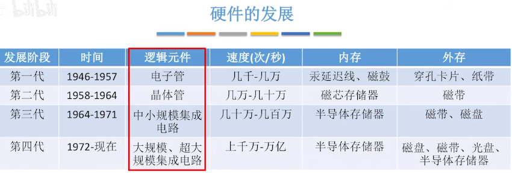
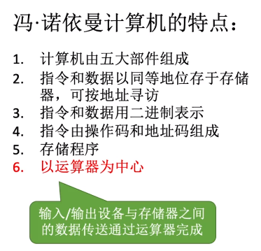
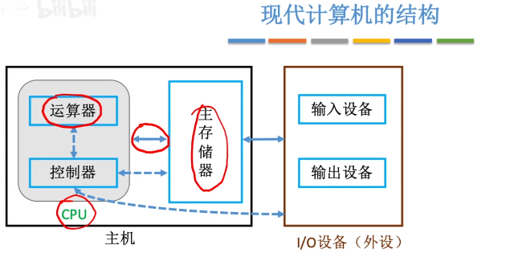
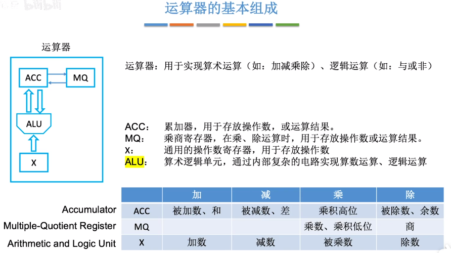
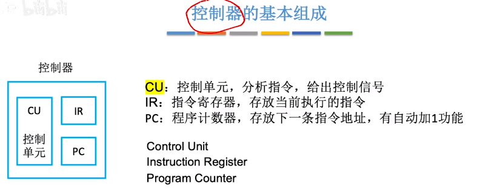

# 计算机组成原理

熵，entropy

随机变量的熵是学习时收到的平均信息量。也表示**需要传输的位数下限**

有符号整数的表示：补码形式

## 计算机的发展

### 第一代：电子管

使用机器语言编程——纸带机

bug的由来就是万一纸带上出现小虫子则程序会错误

### 第二代：晶体管

出现面向过程的程序设计语言：FORTRAN

有了OS雏形

### 第三代：中小规模集成电路

元件集成在基片，可靠性比手动焊接的晶体管高的多

### 第四代：大规模集成电路

出现微处理器（CPU），个人计算机的萌芽

机器字长：一次整数运算所能处理的二进制位数

### 硬件的发展

1947年，贝尔实验室，**肖克利**（晶体管之父）发明了**晶体管**

1955年肖克利在硅谷创建肖克利实验室，并招了8个人

1957年，八叛徒辞职，并创立了**仙童半导体公司**

1959年，仙童半导体公司发明了**集成电路**

1968年，**摩尔**等人离开仙童，创立了**Intel**

1969年，**桑德斯**离开仙童，创立了**AMD**

**摩尔定律**：集成电路上可容纳的晶体管数目每隔18个月会增加一倍

## 计算机硬件的组成

**冯诺依曼**是世界上第一台计算机**ENIAC**的设计顾问，但是ENIAC是需要手动接线来控制计算，为了解决人机速度差异，他首次提出**存储程序**的概念

存储结构 ：将指令以二进制形式事先输入计算机的主存储器

### 冯诺依曼结构

EDVAC：第一台采用冯诺依曼结构的计算机

### 现代计算器的结构

以**存储器**为中心，可以解放运算器

**运算器 + 控制器 = CPU**

## 硬件工作原理

**MAR**位数：反映**存储单元的个数**

MDR位数 = 存储字长（每个存储单元存储的单元） = 一个**字**

完成一条指令的步骤：

1. **取指令 PC**
2. **存放当前指令 IR**
3. **分析指令 CU**

CPU中ALU和CU制作成本最高

### 工作过程

**层次结构**

#### 运算器

***负责算术运算和逻辑运算***

- **ACC：累加器**
- MQ：乘商寄存器
- X：通用操作数寄存器
- **ALU：算术逻辑单元**

#### 控制器

**PC ——> MAR,MDR （取指令）——> IR （分析指令）——> CU （执行指令）**

- **PC**：程序计数器：**存放下一条指令的地址**
- **IR**：指令寄存器，**存放当前执行的指令**
- **CU：控制单元**，分析指令，给出控制信号

## 存储器的性能

### CPU性能指标

3.6GHz  = CPU**主频**：**CPU内数字脉冲信号振荡的频率**

IPS：每秒执行多少指令 = 主频 / 平均CPI

**数据通路带宽**：数据总线以此所能并行传送信息的位数

吞吐量：系统在单位时间内处理请求的数量

## 进位计数制

如图，二进制转8/16进制时，小数点前在**最前**（高位）补0，小数点后在**最后（低位）**补0

8或16进制转到2进制**<u>不够的前面补0</u>**

## 十进制转为任意进制

整数部分：

小数部分：

## BCD码

***二进制表示十进制数的方式，每四个二进制位对应一个十进制数***

**8421码** ：超过1001 的 + 0110（6）来修正，原理是***把不在映射表的部分通过溢出获取再转化回映射表中***

余三码（无权码）和  2421码

## 无符号整数

N位无符号整数表示范围：0 - 2^N - 1

加法：正常加法，从最低位开始，按位相加，并往更高位进位

减法：

1. **被减数不变**
2. **减数按位取反，末位加1**
3. **按位相加**

## 有符号整数

计算机内所有***带符号整数的加减法都需要先转化为补码***

### 原码，反码，补码，移码

***补码：可以克服原码的缺点，让符号位也可以参与计算***

计算机内部存储时候用的是**<u>*补码*</u>**

补码 -> 原码：**从右往左找到第一个1，将这个1左边所有的数值位取反**

X -> -X的补码表示：**<u>全部按位取反，然后末位+1</u>**

### 总结

移码：**补码的符号位取反**，只能用于表示整数

## 字符与字符串

ASCII码，可印刷字符：32-126，其余为**控制或通信字符**，所有***大写字母二进制前三位都是一样的010***

### 汉字

用的是94*94的区位码，GB2312-80

## 定点小数

## 奇偶校验码

***一种可以发现数据错误的编码方式***

- 奇校验码：使得整个传输数据中1的个数是奇数
- 偶校验码：使得整个传输数据中1的个数是偶数

**局限性：同时错误两个位的话检测不出来**

偶校验的硬件实验：***各位进行异或运算***，就能得到偶校验位

## 乘法运算

### 原码乘法

***本质：n位计算，加法加移位，重复n次***

符号位单独处理

步骤：

### 补码一位乘法

## 除法运算

### 原码除法

恢复余数法：

1. 上商1；错了（ACC首位是1，即是负数）， 改为商0，并恢复余数
2. ACC、MQ逻辑左移

加减交替法：不恢复余数法

## 数据类型转换

## 大小端法

大端：方便人类阅读，高有效字节存在低地址

小端：方便机器处理，高有效字节存在高地址

## 浮点数

**IEEE 754标准**

阶码全0或全1对浮点数用作特殊用途

例：

## 寻址方式

## 系统结构

### CPU及工作过程

### 计算器工作原理

分三个阶段：取指令——分析指令——执行指令

CPU区分（MDR）取的是指令还是数据的依据：指令周期的不同阶段

### 性能指标

## 存储器

### 层次结构

***高速缓冲存储器： 主存的速度已经很快，但还是跟不上CPU的速度，所以需要一个cache来保存频繁使用的数据或代码***

***m.2接口的SSD固态硬盘比机械硬盘的读写速度要快得多，所以系统盘放在SSD的启动速度会更快***

### 存取方式

***存放BIOS的ROM一般集成在主板上***

### RAM

***易失性，断电后数据消失***

#### SRAM 和  DRAM

- **DRAM：动态RAM，用于主存**
- **SRAM：静态RAM，用于Cache**

- **读写速度**： SRAM > DRAM，**DRAM中电容放电是破坏性读写，需要重写操作**
- **成本**：SRAM > DRAM，因为 **SRAM需要6个mos管**

原理：

***存储元件的不同*：触发器 ，电容（需要刷新）**

> **DRAM:电容内的电荷只能维持2ms，*即便不断电，2ms后信息也会消失,所以2ms之内必须刷新，给电容充电***
>
> **SRAM:只要不断电，触发器的状态就不会改变**

**地址线复用技术**：只有DRAM采用，***行地址和列地址分两次传输***，<u>地址线和芯片引脚数减半</u>

### ROM

***非易失性，断电后数据不会丢失***

 ***主板上的BIOS芯片（ROM）存储了自举装入程序，负责引导装入操作系统（开机）***

### 双端口RAM

***优化多核CPU访问一个内存条的速度***

需要两组完全独立的数据线，地址线，控制线。CPU，主板需要更复杂的控制电路

### 多体并行存储器

#### 高位交叉/**低位交叉**

*** ***

**核心**：

存储器读取一个字需要一个周期（即存储周期），总线再将此字传输出去需要一个周期（总线周期）

> **存储周期，是指主存储器两次启动操作之间需要的最小时间间隔**，也称之为主存储器周期时间。
>
> 本质是因为***内存要刷新，因为内存是破坏性读取***。

单体存储器是一个字用一个存储周期，再等一个总线周期，然后再开始下一个存储周期去读取下一个字。

多体低位交叉编址采用了流水线的方式，就是说存储器在一个存储模块开始一个存储周期时，经过一个总线周期或多一些时间的延迟让下一个存储模块并行读取下一个字，节省了后续的模块读取时间。

**高位交叉**：适合于并行工作的高位交叉编址的多体存储器结构示意图，图中程序因按体内地址顺序存放（一个体存满后，再存入下一个体），故又有顺序存储之称。

​		**高位地址可表示体号，低位地址为体内地址**。按这种编址方式，只要合理调动，使不同的请求源同时访问不同的体，便可实现并行工作。例如，当一个体正与CPU交换信息时，另一个体可同时与外部设备进行直接存储器访问，实现两个体并行工作。这种编址方式由于***一个体内的地址是连续的，有利于存储器的扩充***。

**低位交叉**：由于程序连续存放在相邻体中，故又有交叉存储之称。

​		**低位地址用来表示体号，高位地址为体内地址**。这种编址方式又称为模M编址（M等于模块数），一般模块数取2的方幂，使硬件电路比较简单。有的机器为了减少存储器冲突，采取质数个模块。

#### **双通道内存**

***打游戏速度会提高很多***，本质就是**利用低位交叉的多体存储器**，最好是**两个主频，容量相同的内存条**，否则会有高主频的内存条降频，造成性能浪费

***内存条插在相同颜色卡槽才是低位交叉编址，否则是高位交叉编址，相当于单纯的扩容***

这就是为什么***8g * 2 的内存条组成双通道的话性能会比 16g的性能更好***

> 很多厂商卖内存条也是多少G*2这样来卖

### 多模块存储器

多体并行和单体多字速度差不多

- **单体多字灵活性差一点，一次读一行，可能有冗余信息，但读取连续地址的时候速度更快**
- **多体并行更准确读取**

### 磁盘存储器

#### 性能指标

**每个磁道存储的位信息是相同的，所以越外圈位密度越小**

#### 磁盘地址

- **驱动器号**：选中的硬盘
- **柱面号，磁道号**：移动磁头臂来寻道
- **盘面号**：选择哪个磁头
- **扇区号**：旋转将特定扇区划到磁头下方

#### 磁盘阵列

***用多个独立的物理磁盘组成一个逻辑盘，数据在多个物理盘上分割交叉存储，并行访问*，有更好的存储性能，多用于云存储等**

RAID越往下数据可靠性，安全性越好

## 固态硬盘SSD

机械硬盘用***盘面上的磁性物质***存储数据，而SSD利用***闪存技术***来存储数据

### 性能对比

- SSD**读写速度快，用电路控制访问**
- 机械硬盘通过**移动磁臂旋转磁盘来控制访问位置**，有寻道时间和旋转延迟

> **SSD一个块被擦除次数过多会坏掉，而机械硬盘的扇区不会因为写的次数太多而坏掉**

### 结构

***闪存翻译层 + 存储介质***

闪存翻译：将系统要读写的逻辑块号翻译到对应的物理地址（页）

固态磁盘的读写单位是**页**，相当于磁盘的一个**扇区**

> ***固态硬盘以块为单位来“擦除”***，一个块相当于一个磁道
>
> 因此SSD的**<u>读操作比写操作会快得多</u>**，***因为写操作可能出现擦除和数据迁移的情况***
>
> 

### 磨损均衡技术

***将“擦除”平均分配到每个块上，以提高固态硬盘的寿命***

- 动态：**写入的时候触发**，**<u>优先选择擦除次数少的块</u>**
- 静态：SSD自动检测并进行数据迁移，**<u>将读多写少的块和写多读少的块互换地址</u>**

例：

> **现在SSD很难用到闪存块写坏掉**

## Cache

***Cache来作为缓和 CPU ——主存 之间的速度矛盾***

- **Cache速度比内存快60倍**
- Cache被**<u>集成在CPU内部，用SRAM实现</u>**，速度快，成本高

就算利用双端口RAM和多模块存储器技术提高存储器的工作速度，优化后的速度和CPU比差距还是很大

### 局部性原理

***最近的要用的信息（指令和数据），很可能与正在使用的信息在存储空间中是相邻的***

因为**<u>空间局部性</u>**的原因，***二维数组访问的时候，行访问比列访问的效率高，因为Cache更容易命中***

主存与Cache之间是***<u>以块为单位来交换数据</u>***

### 性能分析

例：

两种访问方式：

- Cache，主存同时访问
- 先访问Cache，未命中的话再访问主存

### Cache与主存的映射关系

#### 全相联映射

主存块可以放在Cache的任意位置

#### 直接映射

每个主存块只能放在一个特定的位置：Cache块号 =  **主存块号 % Cache总块数**

#### 组相联映射

Cache分为若干组，每个主存块可以放在特定分组的任意位置，**组号 = 主存块号 % 分组数**

### Cache替换算法

Cache满了之后怎么替换

#### 随机算法（RAND）

若Cache已满，随机选择一块进行替换，效率很低

#### 先进先出算法（FIFO）

依然没考虑局部性原理，最先被调入的Cache块也有可能被频繁访问

#### **近期最少使用（LRU）**

**<u>*效率最高的算法*</u>**

***考虑了局部性原理，为每一个Cache块设置一个计数器，用于记录每个Cache块已经多久没被访问***

> 注意命中的行计数器清零，***比其低的计数器+1，其余不变（为了保证最大值位数不会增加）***
>
> **<u>2^n的Cache块，计数器只需n位来存储</u>**

#### 最近不经常使用（LFU）

**<u>*为每一个Cache块设置一个计数器，用于记录每个Cache块被访问过几次*</u>**

**没有考虑时间局部性，比如当前使用很多导致计数器很高，但之后完全不用，也无法消除计数器，效率不高**

### Cache的写策略

***为了确保主存和Cache中数据一致性问题***

#### 全写法

write-through，缺点是会**增加访存次数**，因此加入**<u>*写缓冲策略*</u>**

当CPU对Cache写命中时，***<u>必须把数据同时写入Cache和主存</u>***，一般使用写缓冲

> **写缓冲：SRAM实现的FIFO队列，CPU访问SRAM比直接访问主存快得多，等CPU去忙别的时候，由专门控制的电路将写缓冲中的块逐一写回主存**，若写操作频繁，也会因为写缓冲饱和发生阻塞

#### 写回法

write-back，优点是***减少访存次数***，但可能导致数据不一致

***写命中时，只修改Cache的内容，而不是立即写入主存，只有当块被换出时才写回主存***

添加**脏位**信息，表示**<u>Cache中某个块是否被修改过</u>**，位置由标记来判断

#### 非写分配法

***和Cache无关***

not-write-allocate，**<u>搭配全写法使用</u>**，当CPU对Cache写不命中时，***只写入主存，不调入Cache***

#### 写分配法

write-allocate，**<u>搭配写回法使用</u>**，当CPU对Cache写不命中时，***把主存的块调入Cache中，在Cache中修改***

#### 总结

**<u>多级Cache之间常用全写法+非写分配</u>**，我的理解是因为**写缓冲策略对读写速度快的更友好**

## 页式存储器

一***个程序在逻辑上被分为若干个大小相等的“页面”，“页面”大小与“块”的大小相同，然后离散地放入不同的主存块。***

### 虚地址 / 实地址

***操作系统负责将逻辑地址转换到真实的物理地址***

- **逻辑地址：虚地址，程序员视角看的地址**
- **物理地址：实地址，实际在主存中的地址**

**逻辑页号 对应 主存块号**

偏移地址都是相同的

### 页表

***为了逻辑地址和物理地址的转换***

***页表数据在主存中，是逻辑页号与主存块号对应的表***

> **页表基址寄存器**：指明了页表在主存中的存放地址

#### 快表（TLB）

***采用 SRAM，存储页表的副本，为了加快地址变换的过程，类似Cache与主存的关系***

查询一次页表就是一次访存操作，为了***减少访存次数***，根据局部性原理，为页表添加的一个**<u>高速副本</u>**

## 虚拟存储器

### 页式虚拟存储器

有效位表示正在主存中使用，访问位为了实现页面替换，让主存和辅存交换数据

示意图：

### 段式虚拟存储器

不同与页式拆分成大小相等的页面，而是**<u>采用按照功能模块分成大小不同的段</u>**

### 段页式虚拟存储器

***将程序按逻辑结构分“段”，每段再分为大小相等的“页”***

## 存储器层次化结构

## 指令格式

### 指令分类

***机器字长：计算机中CPU在一次操作中能处理的单位字的长度，即运算器能够并行处理和存储器每次读写操作时能包含的二进制码的位数***

### 扩展操作码

***定长指令字结构 + 可变长操作码***

### 指令寻址

**程序计数器PC：指明下一条指令的存放地址**

如果采用**定长指令字结构**，每次**PC+1**就是下一条指令

> 每个指令  = 存储字长

如果采用**变长指令字结构**：

1. 读入一个字，根据操作码判断这条指令的总字节数n，然后PC = PC + n
2. 根据指令类型，CPU可能还需要多次访存，每次读入一个字

**顺序寻址**：

**跳跃寻址**：由**<u>转移指令</u>**指出，例如JMP

### 指令系统

两种设计**<u>指令系统设计方向</u>**

#### CISC  复杂指令集

***例如x86架构，主要用于笔记本，台式机***

思路：**<u>一条指令完成一个复杂功能</u>**

> 每一条指令由一个专门的电路完成

#### RISC 精简指令集

***例如ARM架构，多用于手机，平板***

思路：只提供基本指令，<u>**一条指令只完成一个基本功能，由多条基本指令组合才能完成复杂功能**</u>

> 只提供简单的电路，电路设计相对简单，<u>**功耗低，所以广泛用于移动设备**</u>
>
> 因为**指令字长是定长的**，每个指令执行时间差不多，所以可以轻易完成**<u>并行和流水线技术</u>**

## 数据寻址

***确定指令的地址码指明的真实地址***

常用的有基于程序起始地址偏移，也可以基于PC偏移

根据**<u>*寻址方式位*</u>**来确定寻址方式

### 直接寻址

***只需要2次访存***

### 间接寻址

***可以扩大寻址范围，需要3次访存***

### 隐含寻址

***不显式地给出操作数的地址，而是在指令中隐含着操作数的地址***

> 例：ADD的另一个操作数隐含在ACC中

### 立即寻址

形式地址A就是**操作数本身（立即数），而不是一个地址**，通常采用补码形式

***不需要访存，但A的位数限制了立即数的范围***

### 偏移寻址

#### 基址寻址

***优点：便于程序“浮动”，方便实现多道程序并发运行***

**基址寄存器（BR）**：也叫重定位寄存器，**<u>其中内容由操作系统来负责管理</u>**

#### 变址寻址

**变址寄存器（IX）：面向用户的，可由用户改变，一般作为偏移量，形式地址A不变**

> <u>**适合循环操作**</u>
>
> **原理：设置A为数组的首地址，然后不断改变IX的内容，实现循环遍历**
>
> 

**复合寻址**

BR：程序的基地址

IX：变址映射为有效地址

#### 相对寻址

***将PC的内容加上指令格式中的A形成操作数的有效地址，A为基于下一条指令地址的偏移量***

例：

分出代码段和数据段就是为了访问数据的时候基址不改变，便于程序浮动

### 总结

## 高级语言和机器代码的转换

***指令：操作码 + 地址码***

### 寄存器

X86架构的CPU每个寄存器都是32bit

### AT&T格式

### 常用x86汇编指令

**<u>控制单元CU</u>**解析指令，然后将控制信号告诉**<u>ALU</u>**，ALU进行计算并输出

**条件转移指令**

例：

### 标志位

***cmp a，b本质是计算 a - b，然后根据各个标志位的值得到 a和b的大小关系，模拟出比较***

### 循环语句

#### 条件指令

1. 初始化
2. 比较条件
3. 循环主体

#### loop指令

使得代码更加清晰简洁

**ecx寄存器：循环计数器**

### 函数调用

call 和 ret 指令

当前执行的函数一定在栈顶

- **call指令：IP旧值压栈保存，设置IP新值，无条件转移至被调用函数的第一条指令**
- **ret指令：从函数的栈帧顶部找到IP旧值，将其出栈并恢复IP寄存器**

#### **函数调用栈**

- **esp：指向当前栈帧的栈顶**
- **ebp：指向当前栈帧的栈底**

##### **栈帧结构**

#### 函数切换

被调用者：

1. **保存上层函数的栈帧，设置当前函数的栈帧**
2. 函数内部执行
3. **恢复上一层函数的栈帧**
4. **执行ret指令**

**调用时：**

**enter指令**：等价于push ebp（**<u>esp - 4, 并写入ebp内容</u>**），然后 add

**返回时：**

**leave指令**：mov esp，ebp，然后pop ebp

> **pop指令：esp所指元素出栈，同时esp + 4**，写入寄存器ebp

例：

#### 传参和返回值

- **栈帧底部一定是上一层栈帧基址**
- **栈帧顶部一定是返回地址**
- 将**局部变量**存储在**栈帧底部**区域
- 将**调用参数**存储在**栈帧顶部**区域

> 汇编中的ebp-4，ebp-8等等就是在**<u>访问局部变量</u>**
>
> ebp+8, ebp+12就是在**<u>访问调用参数</u>**

例：  

**调用add之前：**

**调用add时：**

call指令：改变执行流，**<u>*IP返回地址压入栈顶，并跳转到被调用函数的第一条指令*</u>**

**返回上一个函数（caller）：**

leave切换回上一个函数栈帧

**ret指令：**改变执行流回到caller函数，**<u>*从栈顶找到返回地址，出栈并恢复IP值*</u>**

> **函数返回值都放在eax中**

