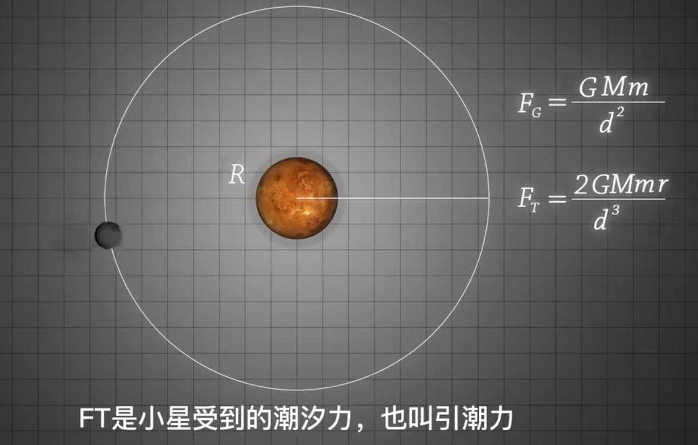
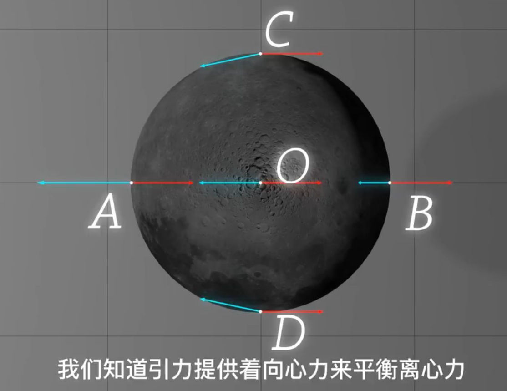
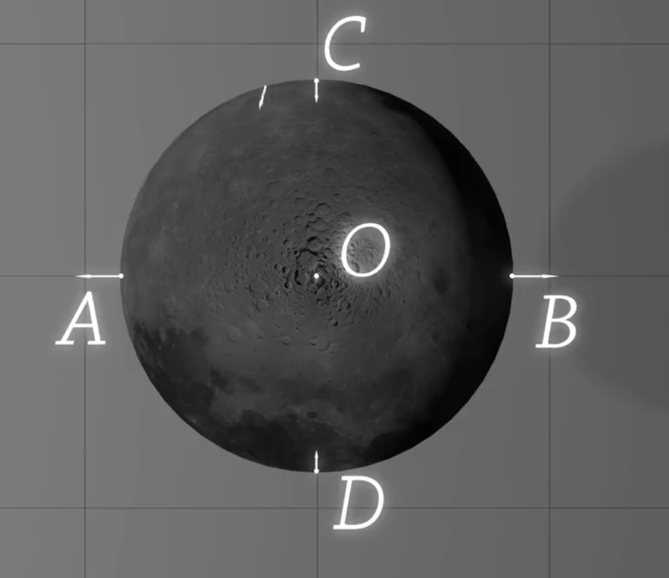
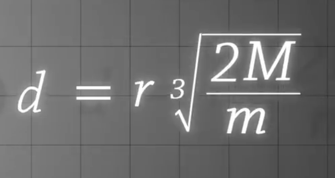
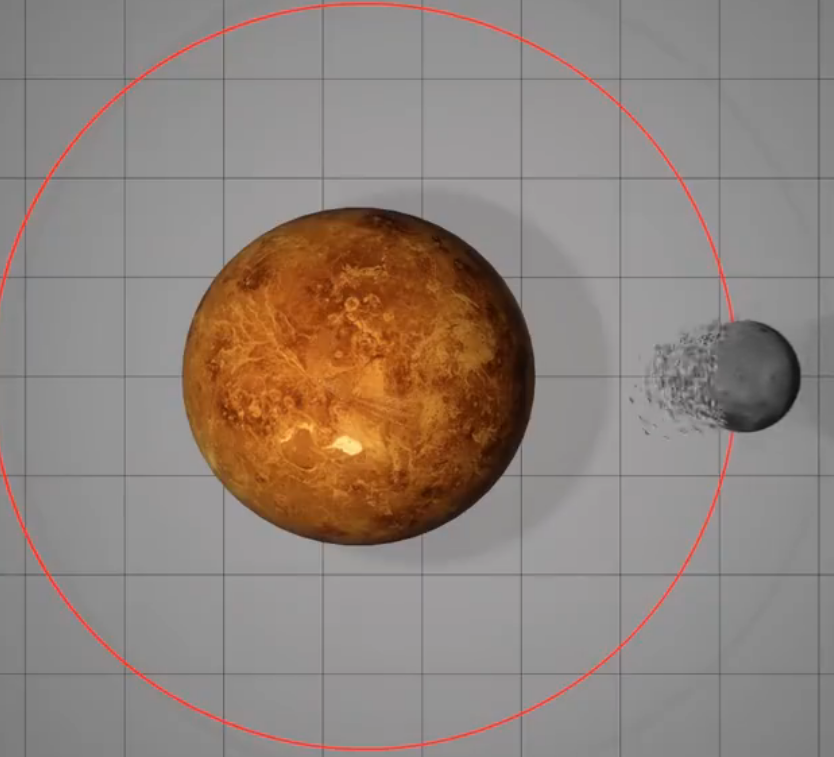
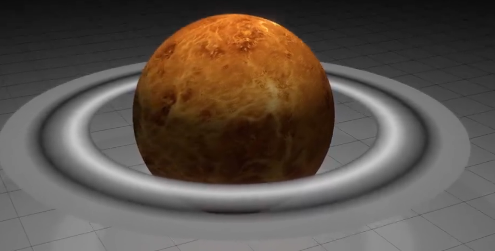

# 天文学

1.每年一月初距离太阳最近 ，地球倾斜的**自转轴**给我们带来了一年四季的变化，不同季节里，阳光入射到不同维度角度不同，赤道区域阳光垂直入射，北半球是**铺开入射**，同一束阳光铺开面积比赤道大了**3倍**，产生的热量也差了3倍

2.地球围绕太阳一周需要一年时间

3.八大行星距离太阳近到远：水金地火木土天海，最近的恒星，也是除太阳外全天最亮的恒星——天狼星（大犬座 α 星）

4.北极星是一颗恒星，可以指示方向

## 洛希极限

**<u>*较大星体施加给小星体的引潮力（离心力）大于小星体自身提供的引力*，趋势小星解体</u>**

**洛希极限**（Roche limit）是**一个天体自身的引力与第二个天体造成的潮汐力相等时**的距离。当两个天体的距离少于洛希极限，天体就会倾向碎散，继而成为第二个天体的环。它以首位计算这个极限的人爱德华·洛希命名。

M, R: 大星的质量与半径

m，r：小星的质量与半径

**FG**：万有引力，用以维系小星的转动

**FT**（引潮力）和FG之间有一定的关系：FT = FG * （2r/d）

> 小星的各点受到的**万有引力不同**
>
> 因为公转产生的**引潮力（离心力）**在小星上**处处相等**
>
> 
>
> **潮汐力：<u>万有引力</u>和<u>离心力</u>的合力**
>
> 
>
> 正是这些力，所以**小星有着沿着大星质心连线方向的拉伸趋势（会变扁）**
>
> 我们不被潮汐力粉碎。是因为连接我们身体的是电磁力，**电磁力要比引力大很多数量级**

当小星移动逐渐靠近大星，使得一点处**潮汐力FT和其受到的万有引力相同**

根据上面公式求解出一个d：和小星的半径，大小星的质量相关，这个**d就是洛希极限**

这个距离内小星上的物质**无法再由小星的万有引力主导**，小星将分崩离析，或者成为**流星雨或者大星的光环**

